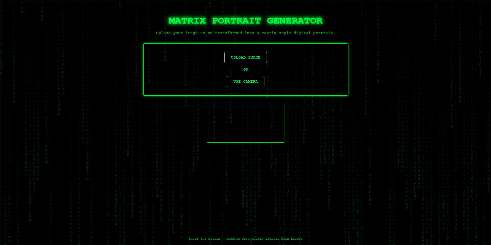
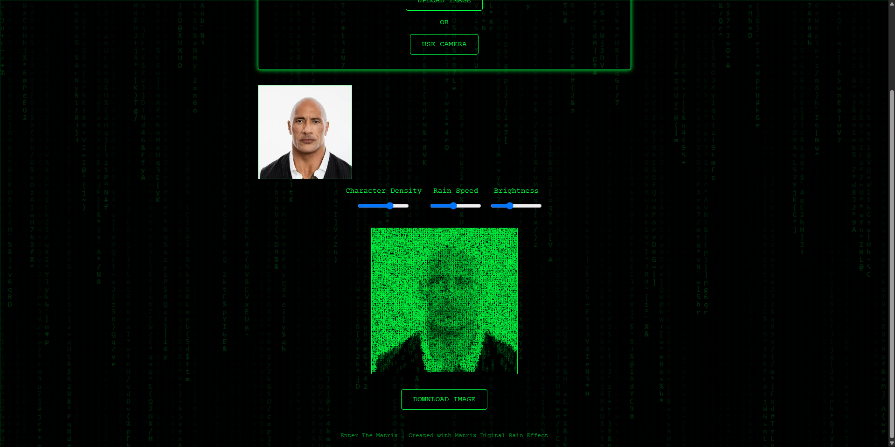

# Matrix Portrait Generator

## Overview

The **Matrix Portrait Generator** is a web-based application that transforms user-uploaded images into a **Matrix-style digital portrait** using an animated rain effect. The project features an immersive experience with a neon-green Matrix digital rain background and a customizable interface for adjusting density, brightness, and rain speed.

## Features

-   **Image Upload & Camera Capture:**
    -   Users can upload an image or capture one using their webcam.
-   **Matrix Digital Rain Effect:**
    -   Animated Matrix-style characters overlay the portrait, creating a cyberpunk aesthetic.
-   **Customizable Controls:**
    -   Adjust character density, rain speed, and brightness for a personalized effect.
-   **Live Preview & Download:**
    -   Users can preview the transformation in real time and download the final portrait.
-   **Dynamic Background:**
    -   A continuous **Matrix digital rain effect** enhances the immersive experience.

## Technologies Used

-   **HTML, CSS, JavaScript** for the frontend.
-   **Canvas API** for rendering the digital rain and image processing.
-   **WebRTC API** for capturing images from the user's camera.

## Demo

<div align="center">
    
    
</div>

## Installation & Usage

### 1. Clone the Repository

```sh
https://github.com/ProtDos/Matrix-Image-Gen.git
```

### 2. Open the `index.html` File

Simply open `index.html` in any modern web browser (Chrome, Firefox, Edge, Safari) to start using the application.

### 3. Upload an Image or Use Camera

-   Click **UPLOAD IMAGE** to select an image from your device.
-   Click **USE CAMERA** to take a live picture.

> Note:
> Low pixel density images may result in matrix images with low details. Increasing the character density may help.

### 4. Customize the Effect

Use the **sliders** to adjust:

-   **Character Density** (1-10 scale)
-   **Rain Speed** (1-10 scale)
-   **Brightness** (1-10 scale)

> Note:
> High density may cause lag and low details. Just experiment with different values.

### 5. Download the Image

Once satisfied, click **DOWNLOAD IMAGE** to save your Matrix-style portrait.

## Hosting

You can clone this repo and go to netlify.com to host this project on your own webpage.

## Browser Compatibility

This project works on modern browsers supporting the Canvas API and WebRTC, including:

-   Google Chrome
-   Mozilla Firefox
-   Microsoft Edge
-   Safari
-   ...and other popular browsers

## License

This project is open-source under the **MIT License**. Feel free to modify and contribute!
